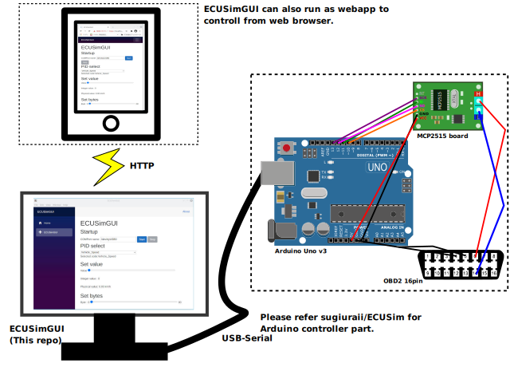

# ECUSimGUI
GUI frontend of [ECUSim, Arduino CAN ECU simulator](https://github.com/sugiuraii/ECUSim)



# Hardwares needed
 - Arduino Uno or its compatilble boards.
 - MCP2515 CAN controller board.

# Dependencies
  - [.NET 6 SDK](https://dotnet.microsoft.com/download), ASP.NET core, Blazor server.
  - [runceel/ReactiveProperty](https://github.com/runceel/ReactiveProperty)
  - [iflight/Logging.Memory](https://github.com/iflight/Logging.Memory)

# Build and run the program
## Install build tools.
* Install [.NET 6 SDK](https://dotnet.microsoft.com/download) and [node.js with npm](https://nodejs.org/).
## Build backend
* Build(publish) dotnet (asp.net) background.
  ```
  dotnet publish  
  ```
## Build and bundle with electron
* Before building electron executabls, please copy backend binary files to `server-bin`.
  ```
  cd electron
  mkdir server-bin
  cd server-bin
  cp -r ../../bin/Debug/net6.0/publish/* ./
  ```
* After that, return to `electron` directory, setup npm and build.
  ```
  cd ECUSimGUI/electron
  npm i
  npm run package
  ```
* It might be better to run the program via CLI, since the logs and errors are output on console.

# License
- MIT license.
