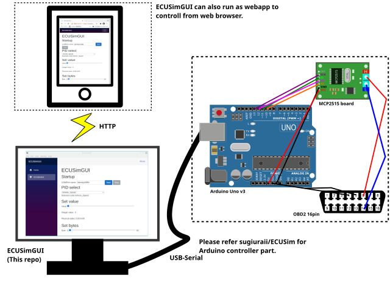

# ECUSimGUI
GUI frontend of [ECUSim, Arduino CAN ECU simulator](https://github.com/sugiuraii/ECUSim)



# Hardwares needed
 - Arduino Uno or its compatilble boards.
 - MCP2515 CAN controller board.

# Dependencies
  - [.NET 8 SDK](https://dotnet.microsoft.com/download), ASP.NET core, Blazor server.
  - [runceel/ReactiveProperty](https://github.com/runceel/ReactiveProperty)
  - [iflight/Logging.Memory](https://github.com/iflight/Logging.Memory)

# How to use
## Write sketch to Arduino uno.
- Download (clone) Arduino sketch from [ECUSim](https://github.com/sugiuraii/ECUSim) and write to Arduino Uno board.
- Wire Arduino Uno board, MCP2515 CAN board following the instruction of ECUSim page.

## Download pre-built binary.
- Download binary archive from [Release](https://github.com/sugiuraii/ECUSimGUI/releases) page.
- After extracting the archive, run `./ecusimgui` (or `ecusimgui.exe`).

# How to build
## Install build tools.
* Install [.NET 8 SDK](https://dotnet.microsoft.com/download) and [node.js with npm](https://nodejs.org/).
## Build backend
* Build(publish) dotnet (asp.net) background.
  ```
  dotnet publish  
  ```
## Build and bundle with electron
* Before building electron executabls, please copy backend binary files to `server-bin`.
  ```
  cd electron
  mkdir server-bin
  cp -r ../bin/Release/net8.0/publish/* ./server-bin/
  ```
* After that, setup npm and build.
  ```
  npm i
  npm run package
  ```
* You will find eletron build on `out` folder.
* It might be better to run the program via CLI, since the logs and errors are output on console.

# License
- MIT license.
