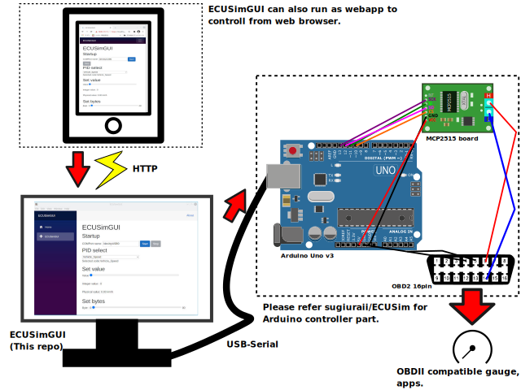

# ECUSimGUI
GUI frontend of [ECUSim, Arduino CAN ECU simulator](https://github.com/sugiuraii/ECUSim)



# Hardwares needed
 - Arduino Uno or its compatilble boards.
 - MCP2515 CAN controller board.

# Dependencies
  - [.NET 5 SDK](https://dotnet.microsoft.com/download), ASP.NET core, Blazor server.
  - [Electron.NET](https://github.com/ElectronNET/Electron.NET)
  - [runceel/ReactiveProperty](https://github.com/runceel/ReactiveProperty)
  - [iflight/Logging.Memory](https://github.com/iflight/Logging.Memory)

# Build and run the program
 - Install [.NET 5 SDK](https://dotnet.microsoft.com/download) and [node.js with npm](https://nodejs.org/).
 - Install ElectronNET.CLI before build the source.
    - `dotnet tool install ElectronNET.CLI -g`
 - After installing them, you can run the program from command of
    - `electronize start`
 - To build the program, run the command as follows
    - `electronize build /target win`
    - `electronize build /target linux`
    - After the build, you can find the binary at `bin/Desktop`.
 - It is better to run the program via CLI, since the logs and errors are output on console.

# Run as web application
 - Add followinng "urls" setting to `appsettings.Development.json` or `appsettings.json` to allow connection from external host.
 ```
 {
  "urls": "http://*:5000;https://*:5001", // Add this line
  "DetailedErrors": true,
  "Logging": {
    "LogLevel": {
      "Default": "Information",
      "Microsoft": "Warning",
      "Microsoft.Hosting.Lifetime": "Information"
    }
  }
}
```
- And run `dotnet run` or `dotnet build` to run/build webserver.

# License
- MIT license.
